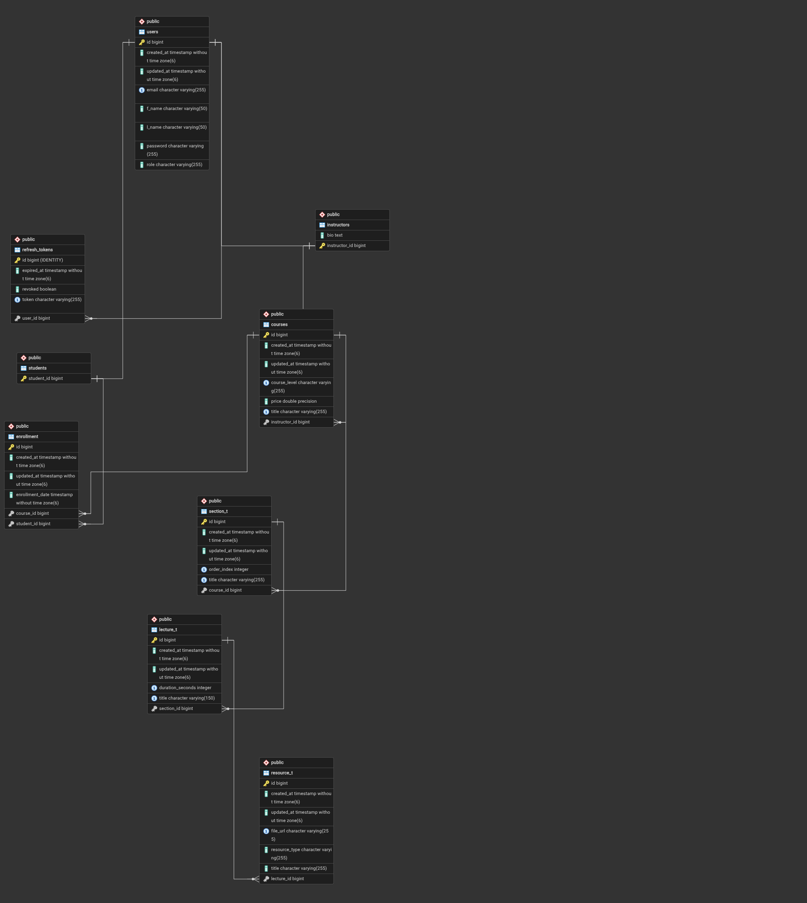
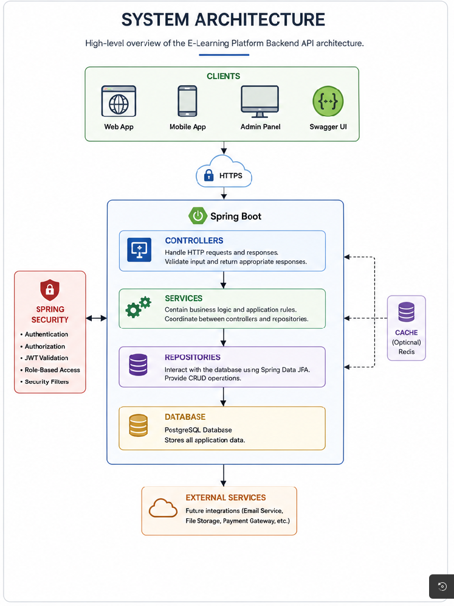
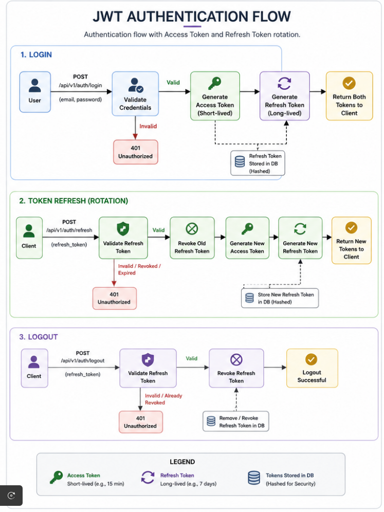

# 🎓 E-Learning Platform Backend API

A production-ready RESTful backend for an e-learning platform built with **Java**, **Spring Boot**, and **PostgreSQL**. The application demonstrates secure authentication, role-based authorization, clean layered architecture, and modern backend development practices.

---

## 📖 Overview

This project provides a secure backend for managing an online learning platform. It supports user authentication, instructor and student management, course creation, enrollments, lectures, sections, and learning resources.

The application follows a layered architecture (Controller → Service → Repository) and is built using Spring Boot best practices with JWT authentication, refresh token rotation, validation, global exception handling, and OpenAPI documentation.

---

## ✨ Features

* 🔐 JWT Authentication
* 🔄 Refresh Token Rotation
* 👥 Role-Based Access Control (RBAC)
* 🛡️ Ownership-Based Authorization
* 📚 Course Management
* 👨‍🏫 Instructor Management
* 👨‍🎓 Student Management
* 📝 Enrollment Management
* 📖 Sections & Lectures
* 📂 Learning Resources
* 📄 Pagination Support
* ✅ Request Validation
* ⚠️ Global Exception Handling
* 📑 Swagger / OpenAPI Documentation
* 🐳 Docker Support
* ☁️ Cloud Deployment on Render

---

## 🛠️ Tech Stack

| Layer             | Technology                  |
| ----------------- | --------------------------- |
| Language          | Java 21                     |
| Framework         | Spring Boot                 |
| Security          | Spring Security + JWT       |
| ORM               | Spring Data JPA (Hibernate) |
| Database          | PostgreSQL                  |
| Build Tool        | Maven                       |
| API Documentation | Swagger / OpenAPI           |
| Deployment        | Render                      |
| Containerization  | Docker                      |

---
## 📐 System Architecture & Design

### Database ER Diagram


### System Architecture


### Authentication & Token Rotation Flow



This separation of concerns makes the application easy to maintain, extend, and test.

---

## 🚀 Live Demo

Backend API

https://elearning-backend-1-f1vf.onrender.com

---

## 📑 API Documentation

Swagger UI

https://elearning-backend-1-f1vf.onrender.com/swagger-ui/index.html

---

## 📌 Main API Modules

* Authentication
* Courses
* Students
* Instructors
* Enrollments
* Sections
* Lectures
* Learning Resources

---

## ⚙️ Getting Started

### Clone the repository

```bash
git clone <https://github.com/mwangimarco231-boop/elearning-backend.git>
cd elearning
```

### Start PostgreSQL using Docker

```bash
docker compose up -d
```

### Run the application

```bash
./mvnw spring-boot:run
```

The application will be available at:

```
https://elearning-backend-1-f1vf.onrender.com
```

Swagger documentation:

```
https://elearning-backend-1-f1vf.onrender.com/swagger-ui/index.html
```

---

## 🔮 Future Improvements

* 💳 Payment Integration
* ⭐ Course Ratings & Reviews
* 🎓 Course Completion Certificates
* 📧 Email Verification & Notifications
* ☁️ Cloud File Storage (AWS S3 / Cloudinary)
* 📊 Analytics Dashboard
* 💬 Course Discussions
* 🔍 Full-Text Search

---

## 👨‍💻 Author

**Marcos Mwangi**

Backend Software Engineer

* GitHub: https://github.com/mwangimarco231-boop/elearning-backend
* LinkedIn: https://linkedin.com/in/marco-mwangi-8317603bb
* Email: mwangimarco231@gmail.com

---

## 📄 License

This project is available for educational and portfolio purposes.
